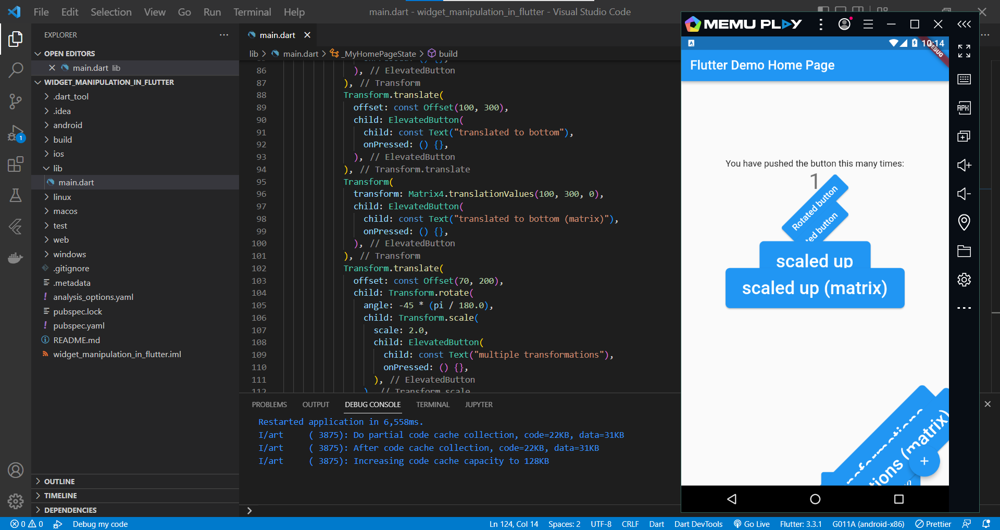
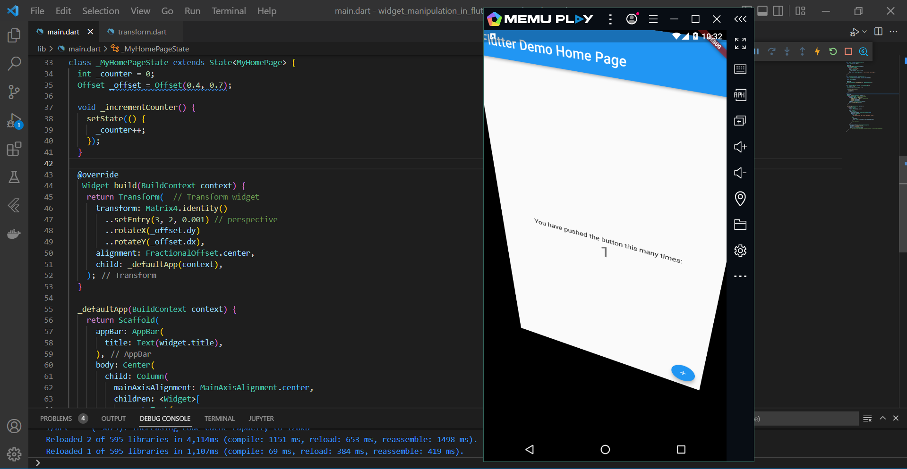
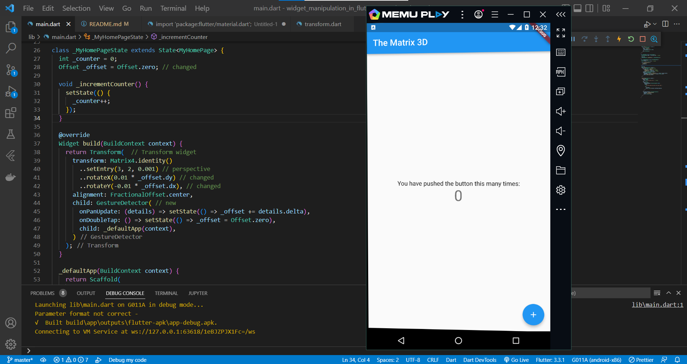
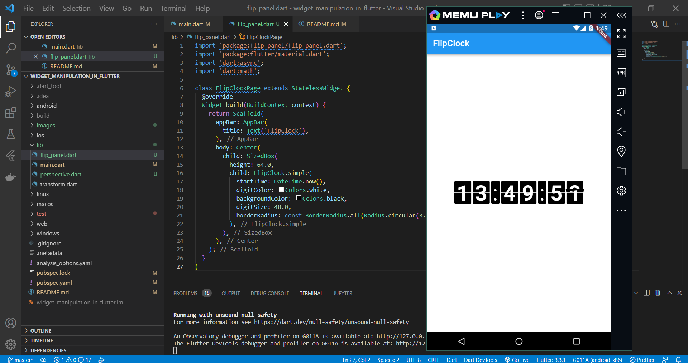

# widget_manipulation_in_flutter

## Praktikum
1. Tranform di flutter 
    
    Pada praktikum ini, kita menggunakan widget tranform. Untuk penggunaannya kita harus import library math terlebih dahulu.
## Tugas
1. Perspective di flutter
    
    

https://user-images.githubusercontent.com/60992683/190958419-3c599f35-a09b-4693-a5a5-743a34c8860b.mp4

2. Flip animasi 3D
    
    

https://user-images.githubusercontent.com/60992683/190958736-a3c29f16-1d6b-418c-bc01-f7b22f3dc7ef.mp4

